EDA
================
Mark Liu & Friends
2026-02-12

### Loading in the dataset and some libraries

## Including Plots

Do the trend plot, as per Lang’s instruction

``` r
#Plot is too crowded, filter out some observations for good measures

dataset_plottable <- filter(dataset_org, ID < 100 | ID > 1900)

#Comparing effect of copper

ggplot(dataset_plottable, aes(x = Time, y = OD, group = ID, color = Cu)) +
geom_line() +
geom_point() +
labs(title = "OD trends", x = "Time", y = "Concentration")
```

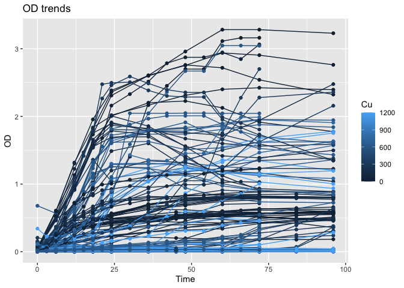<!-- -->

``` r
#Comparing effect of mine

dataset_plottable <- filter(dataset_org, ID < 1000, ID > 750)
ggplot(dataset_plottable, aes(x = Time, y = OD, group = ID, color = Mine)) +
geom_line() +
geom_point() +
labs(title = "OD trends, Colored by Mine", x = "Time", y = "Concentration")
```

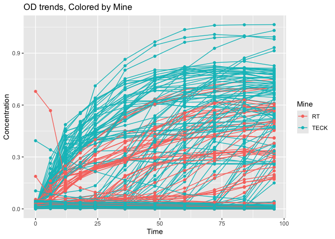<!-- -->

``` r
#Comparing effect of storage

dataset_plottable <- filter(dataset_org, ID > 300, ID < 650)
ggplot(dataset_plottable, aes(x = Time, y = OD, group = ID, color = Storage)) +
geom_line() +
geom_point() +
labs(title = "OD trends, Colored by Storage Method", x = "Time", y = "Concentration")
```

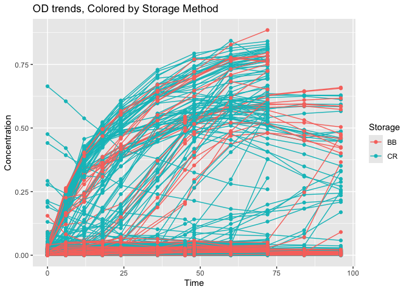<!-- -->

``` r
#Comparing effect of media

dataset_plottable <- filter(dataset_org, ID %in% seq(1, 2000, 10))
ggplot(dataset_plottable, aes(x = Time, y = OD, group = ID, color = Media)) +
geom_line() +
geom_point() +
labs(title = "OD trends, Colored by Media", x = "Time", y = "Concentration")
```

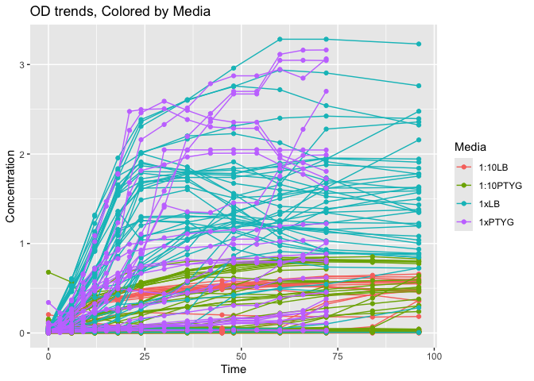<!-- -->

## Including more Plots

Do some cross section plots, as per Lang’s instruction

<!-- -->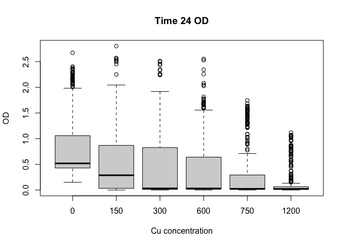<!-- -->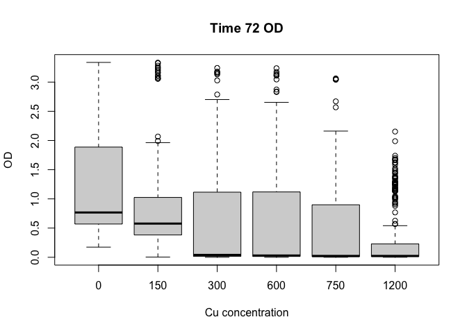<!-- -->

## Including even more Plots

Do some more side by side box plots, just for good measures

``` r
#maximum concentration

boxplot(dataset_mod$Maximum_Concentration ~ dataset_mod$Cu, outline=FALSE, xlab = "Cu concentration", ylab = "Maximum Concentration", main = "Comparing Maximum Concentration via Cu")
```

<!-- -->

``` r
boxplot(dataset_mod$Maximum_Concentration ~ dataset_mod$Mine, outline=FALSE, xlab = "Mine", ylab = "Maximum Concentration", main = "Comparing Maximum Concentration via Mine")
```

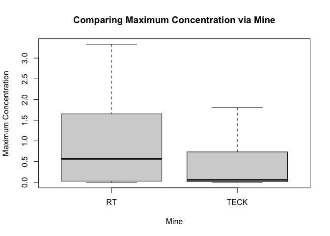<!-- -->

``` r
boxplot(dataset_mod$Maximum_Concentration ~ dataset_mod$Storage, outline=FALSE, xlab = "Storage", ylab = "Maximum Concentration", main = "Comparing Maximum Concentration via Storage")
```

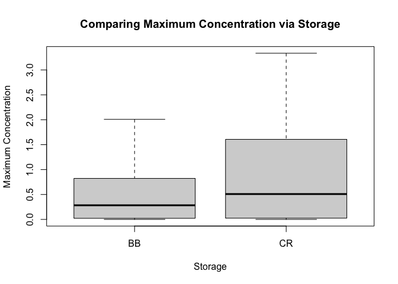<!-- -->

``` r
boxplot(dataset_mod$Maximum_Concentration ~ dataset_mod$Storage, outline=FALSE, xlab = "Media", ylab = "Maximum Concentration", main = "Comparing Maximum Concentration via Media")
```

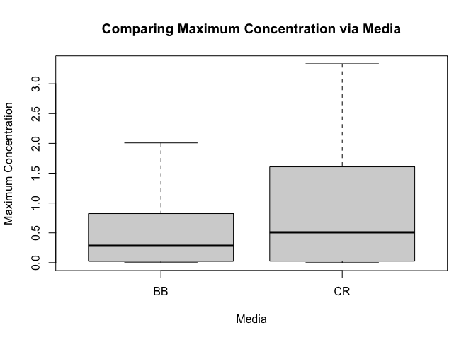<!-- -->

``` r
#mu max

boxplot(dataset_mod$mu_max ~ dataset_mod$Cu, outline=FALSE, xlab = "Cu concentration", ylab = "mu max", main = "Comparing Mu Max via Cu")
```

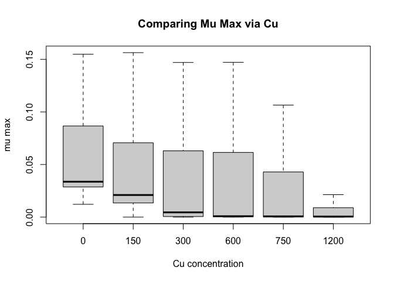<!-- -->

``` r
boxplot(dataset_mod$mu_max ~ dataset_mod$Mine, outline=FALSE, xlab = "Mine", ylab = "Mu Max", main = "Comparing Mu Max via Mine")
```

<!-- -->

``` r
boxplot(dataset_mod$mu_max ~ dataset_mod$Storage, outline=FALSE, xlab = "Storage", ylab = "Mu Max", main = "Comparing Mu Max via Storage")
```

<!-- -->

``` r
boxplot(dataset_mod$mu_max ~ dataset_mod$Media, outline=FALSE, xlab = "Media", ylab = "Mu Max", main = "Comparing Mu Max via Media")
```

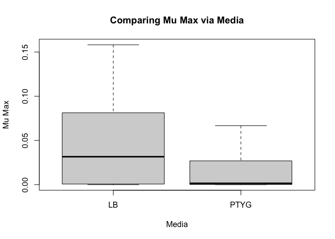<!-- -->

``` r
# lag time

boxplot(as.integer(dataset_mod$lag_time) ~ dataset_mod$Cu, outline=FALSE, xlab = "Cu concentration", ylab = "Lag Time", main = "Comparing Lag Time via Cu")
```

    ## Warning in eval(predvars, data, env): NAs introduced by coercion

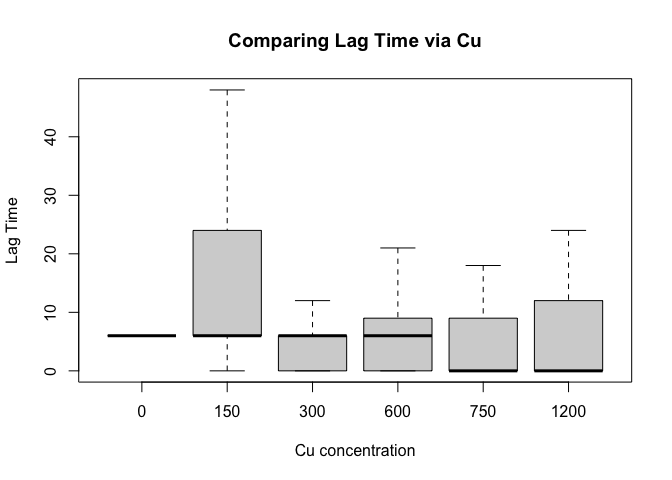<!-- -->

``` r
boxplot(as.integer(dataset_mod$lag_time) ~ dataset_mod$Mine, outline=FALSE, xlab = "Mine", ylab = "Lag Time", main = "Comparing Lag Time via Mine")
```

    ## Warning in eval(predvars, data, env): NAs introduced by coercion

<!-- -->

``` r
boxplot(as.integer(dataset_mod$lag_time) ~ dataset_mod$Storage, outline=FALSE, xlab = "Storage", ylab = "Lag Time", main = "Comparing Lag Time via Storage")
```

    ## Warning in eval(predvars, data, env): NAs introduced by coercion

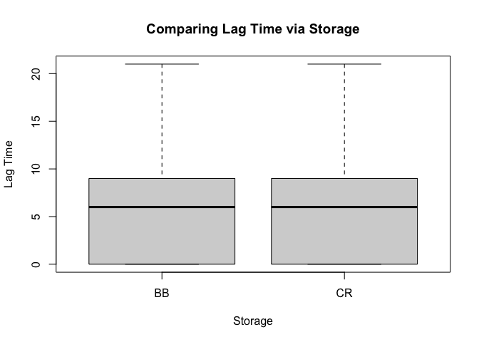<!-- -->

``` r
boxplot(as.integer(dataset_mod$lag_time) ~ dataset_mod$Media, outline=FALSE, xlab = "Media", ylab = "Lag Time", main = "Comparing Lag Time via Media")
```

    ## Warning in eval(predvars, data, env): NAs introduced by coercion

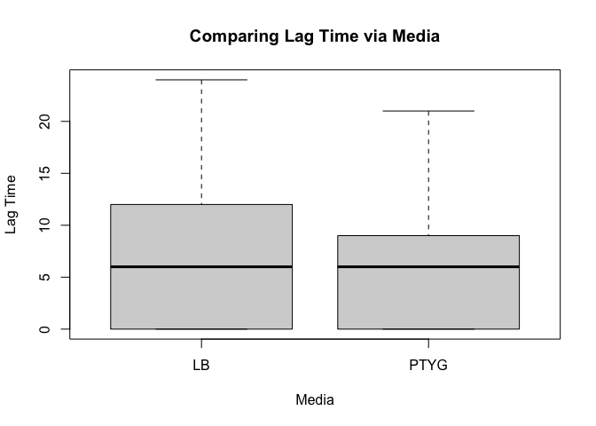<!-- -->

``` r
hist(dataset_mod$Maximum_Concentration, main = "Histogram of Maximum Concentration", xlab = " Maximum Concentration (OD600)")
```

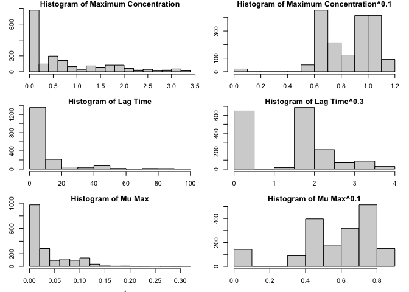<!-- -->

``` r
hist(as.numeric(dataset_mod$lag_time),, main = "Histogram of Lag Time", xlab = "Lag Time (h)")
```

    ## Warning in hist(as.numeric(dataset_mod$lag_time), , main = "Histogram of Lag
    ## Time", : NAs introduced by coercion

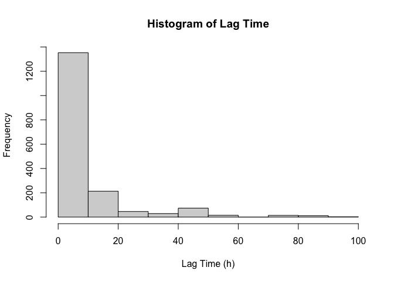<!-- -->

``` r
hist(dataset_mod$mu_max, main = "Histogram of Mu Max",xlab = expression("Mu Max (" * h^{-1} * ")"),ylab = "Frequency")
```

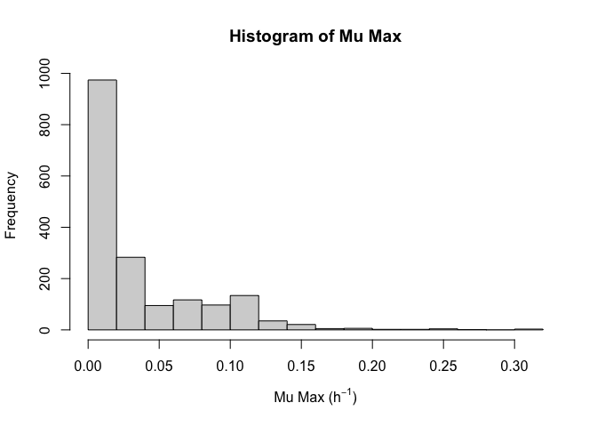<!-- -->

``` r
hist(dataset_mod$mu_max^0.1, main = "Histogram of power-transformed Mu Max",xlab = "Mu Max^0.1",ylab = "Frequency")
```

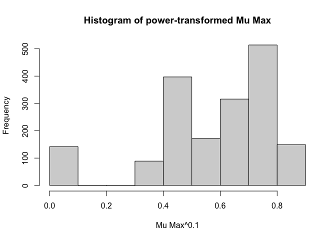<!-- -->
