EDA
================
Mark Liu & Friends
2026-02-12

### Loading in the dataset and some libraries

## Including Plots

Do the trend plot, as per Lang’s instruction

``` r
#Plot is too crowded, filter out some observations for good measures

dataset_plottable <- filter(dataset_org, ID %in% seq(1, 2000, 10))

#Comparing effect of copper

ggplot(dataset_plottable, aes(x = Time, y = OD, group = ID, color = Cu)) +
geom_line() +
geom_point() +
labs(title = "OD trends", x = "Time", y = "OD")
```

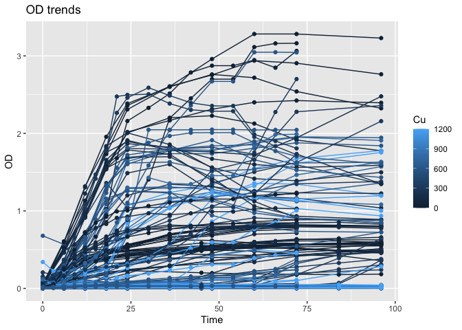<!-- -->

``` r
#Comparing effect of mine

ggplot(dataset_plottable, aes(x = Time, y = OD, group = ID, color = Mine)) +
  geom_line() +
  geom_point() +
  labs(title = "Select OD trends, Colored by Mine",
       x = "Time",
       y = "OD") +
  facet_wrap(~ Mine)
```

<!-- -->

``` r
#Comparing effect of storage

ggplot(dataset_plottable, aes(x = Time, y = OD, group = ID, color = Storage)) +
  geom_line() +
  geom_point() +
  labs(title = "Select OD trends, Colored by Storage",
       x = "Time",
       y = "OD") +
  facet_wrap(~ Storage)
```

<!-- -->

``` r
#Comparing effect of media

ggplot(dataset_plottable, aes(x = Time, y = OD, group = ID, color = Media_Name)) +
  geom_line() +
  geom_point() +
  labs(title = "Select OD trends, Colored by Type of Media",
       x = "Time",
       y = "OD") +
  facet_wrap(~ Media_Name)
```

<!-- -->

``` r
ggplot(dataset_plottable, aes(x = Time, y = OD, group = ID, color = Dilution)) +
  geom_line() +
  geom_point() +
  labs(title = "Select OD trends, Colored by Media Dilution",
       x = "Time",
       y = "OD") +
  facet_wrap(~ Dilution)
```

<!-- -->

``` r
#

ggplot(dataset_plottable, aes(x = Time, y = OD, group = ID, color = Cu)) +
  geom_line() +
  geom_point() +
  labs(title = "Select OD trends, Colored by Copper Concentration",
       x = "Time",
       y = "OD") +
  facet_wrap(~ Cu)
```

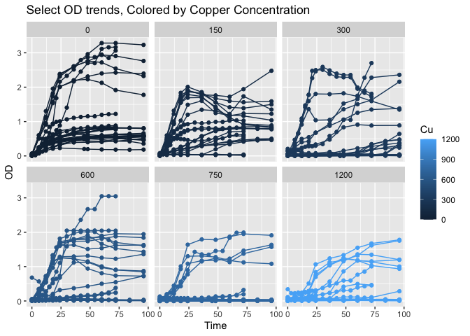<!-- -->

``` r
summary_data <- filter(dataset_org, Dilution == "1") %>%
  group_by(Cu, Time) %>%
  summarise(
    median_OD = median(OD, na.rm = TRUE),
    p25 = quantile(OD, 0.25, na.rm = TRUE),
    p75 = quantile(OD, 0.75, na.rm = TRUE),
    .groups = "drop"
  )

ggplot(summary_data,
       aes(x = Time,
           y = median_OD,
           color = Cu,
           fill = Cu,
           group = Cu)) +
  geom_ribbon(aes(ymin = p25, ymax = p75),
              alpha = 0.2,
              color = NA) +
  geom_line(linewidth = 1) +
  labs(title = "Median OD with IQR",
       x = "Time",
       y = "OD")
```

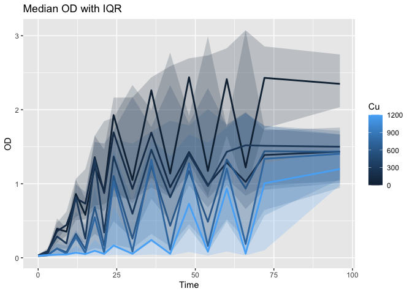<!-- -->

## Including more Plots

Do some cross section plots, as per Lang’s instruction

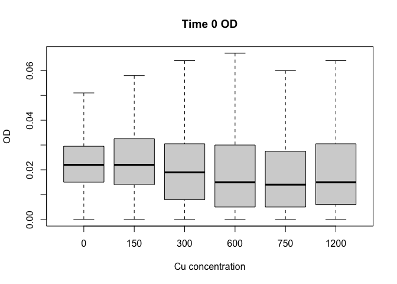<!-- -->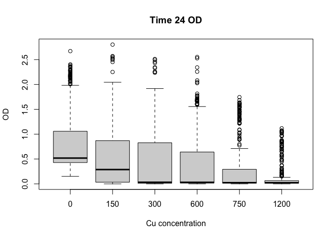<!-- -->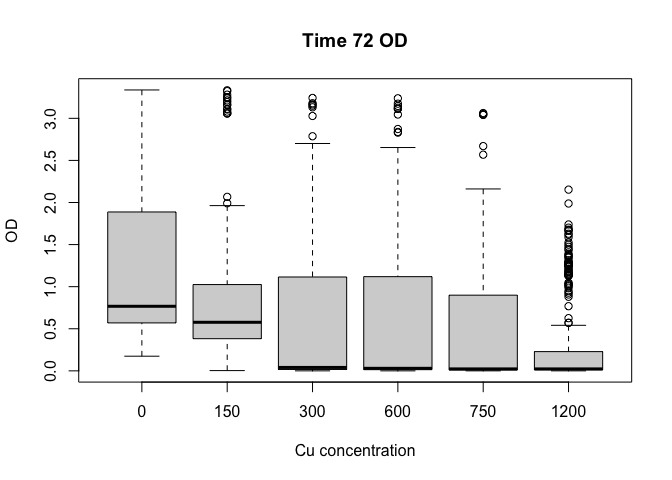<!-- -->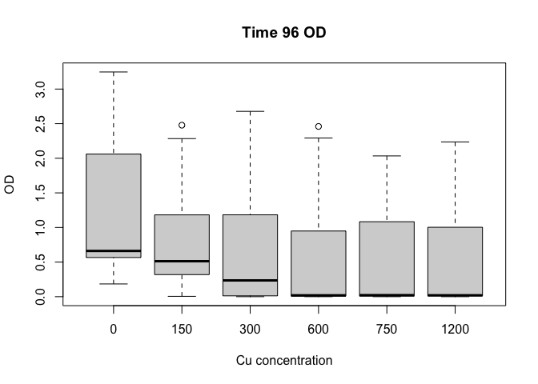<!-- -->

## Including even more Plots

Do some more side by side box plots, just for good measures

``` r
#maximum concentration

boxplot(dataset_mod$Maximum_Concentration ~ dataset_mod$Cu, outline=FALSE, xlab = "Cu concentration", ylab = "Maximum Concentration", main = "Comparing Maximum Concentration via Cu")
```

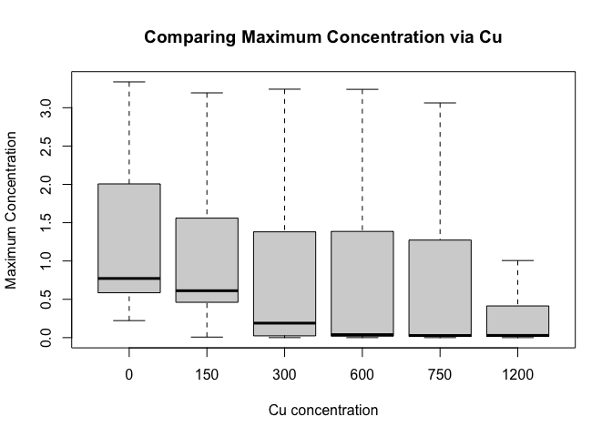<!-- -->

``` r
boxplot(dataset_mod$Maximum_Concentration ~ dataset_mod$Mine, outline=FALSE, xlab = "Mine", ylab = "Maximum Concentration", main = "Comparing Maximum Concentration via Mine")
```

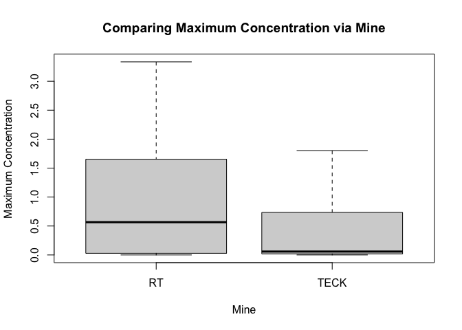<!-- -->

``` r
boxplot(dataset_mod$Maximum_Concentration ~ dataset_mod$Storage, outline=FALSE, xlab = "Storage", ylab = "Maximum Concentration", main = "Comparing Maximum Concentration via Storage")
```

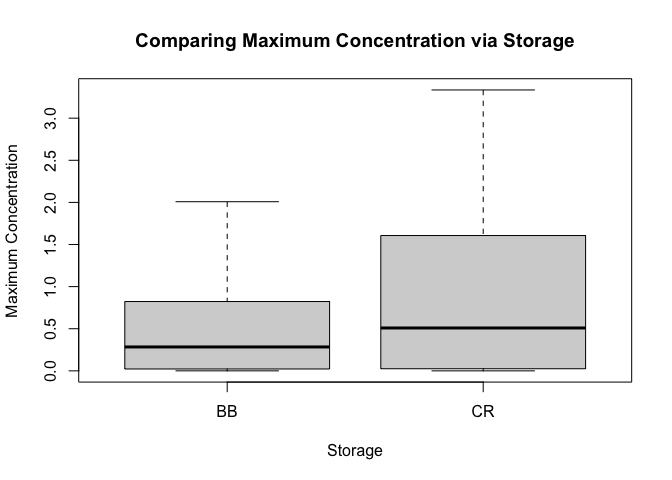<!-- -->

``` r
boxplot(dataset_mod$Maximum_Concentration ~ dataset_mod$Storage, outline=FALSE, xlab = "Media", ylab = "Maximum Concentration", main = "Comparing Maximum Concentration via Media")
```

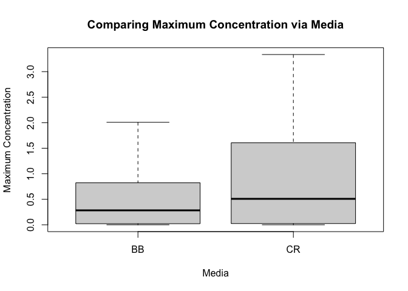<!-- -->

``` r
#mu max

boxplot(dataset_mod$mu_max ~ dataset_mod$Cu, outline=FALSE, xlab = "Cu concentration", ylab = "mu max", main = "Comparing Mu Max via Cu")
```

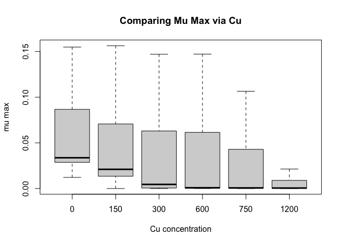<!-- -->

``` r
boxplot(dataset_mod$mu_max ~ dataset_mod$Mine, outline=FALSE, xlab = "Mine", ylab = "Mu Max", main = "Comparing Mu Max via Mine")
```

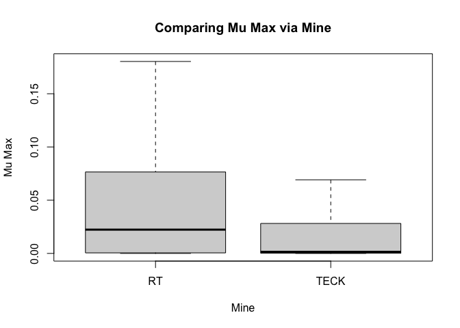<!-- -->

``` r
boxplot(dataset_mod$mu_max ~ dataset_mod$Storage, outline=FALSE, xlab = "Storage", ylab = "Mu Max", main = "Comparing Mu Max via Storage")
```

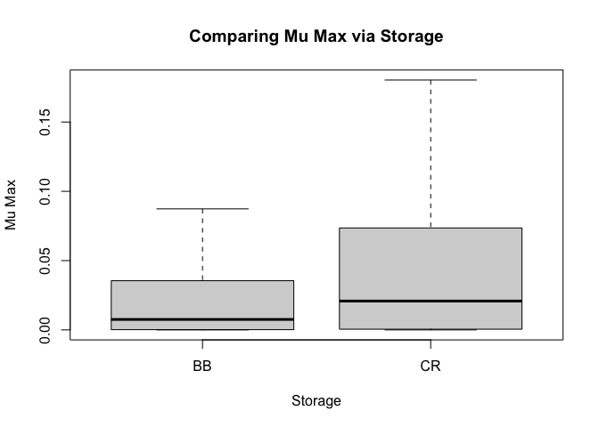<!-- -->

``` r
boxplot(dataset_mod$mu_max ~ dataset_mod$Media, outline=FALSE, xlab = "Media", ylab = "Mu Max", main = "Comparing Mu Max via Media")
```

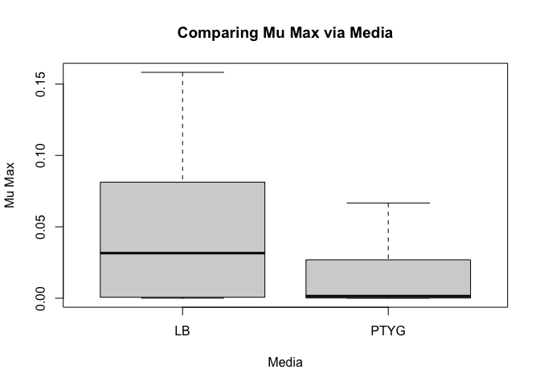<!-- -->

``` r
# lag time

boxplot(as.integer(dataset_mod$lag_time) ~ dataset_mod$Cu, outline=FALSE, xlab = "Cu concentration", ylab = "Lag Time", main = "Comparing Lag Time via Cu")
```

    ## Warning in eval(predvars, data, env): NAs introduced by coercion

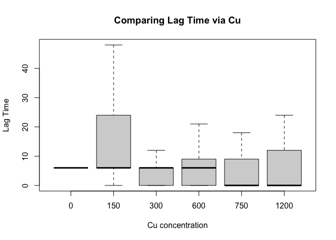<!-- -->

``` r
boxplot(as.integer(dataset_mod$lag_time) ~ dataset_mod$Mine, outline=FALSE, xlab = "Mine", ylab = "Lag Time", main = "Comparing Lag Time via Mine")
```

    ## Warning in eval(predvars, data, env): NAs introduced by coercion

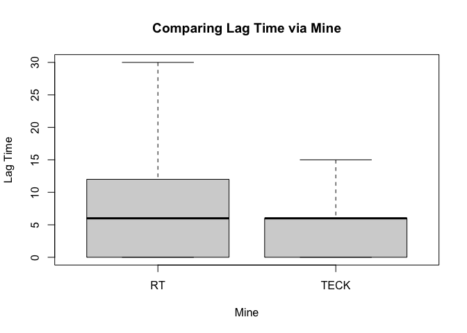<!-- -->

``` r
boxplot(as.integer(dataset_mod$lag_time) ~ dataset_mod$Storage, outline=FALSE, xlab = "Storage", ylab = "Lag Time", main = "Comparing Lag Time via Storage")
```

    ## Warning in eval(predvars, data, env): NAs introduced by coercion

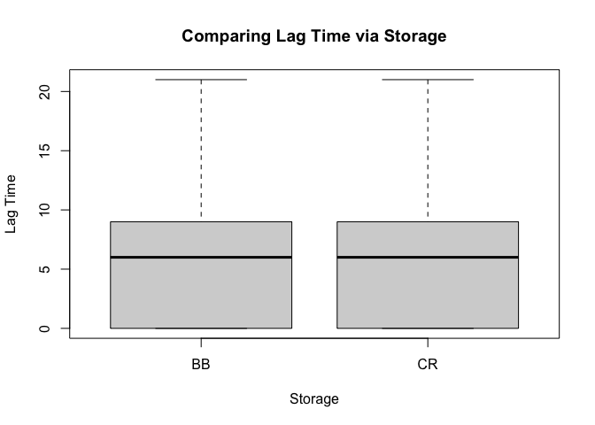<!-- -->

``` r
boxplot(as.integer(dataset_mod$lag_time) ~ dataset_mod$Media, outline=FALSE, xlab = "Media", ylab = "Lag Time", main = "Comparing Lag Time via Media")
```

    ## Warning in eval(predvars, data, env): NAs introduced by coercion

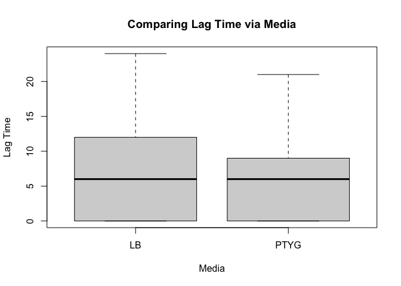<!-- -->

``` r
par(mfrow = c(3,2), 
    mar = c(3,3,1,1))

hist(dataset_mod$Maximum_Concentration, main = "Histogram of Maximum Concentration", xlab = " Maximum Concentration (OD600)")

hist(dataset_mod$Maximum_Concentration^0.1, main = "Histogram of Maximum Concentration^0.1",xlab = "Maximum_Concentration^0.1",ylab = "Frequency")


hist(as.numeric(dataset_mod$lag_time),, main = "Histogram of Lag Time", xlab = "Lag Time")
```

    ## Warning in hist(as.numeric(dataset_mod$lag_time), , main = "Histogram of Lag
    ## Time", : NAs introduced by coercion

``` r
hist(as.numeric(dataset_mod$lag_time)^0.3, main = "Histogram of Lag Time^0.3",xlab = "lag_time^0.3",ylab = "Frequency")
```

    ## Warning in hist(as.numeric(dataset_mod$lag_time)^0.3, main = "Histogram of Lag
    ## Time^0.3", : NAs introduced by coercion

``` r
hist(dataset_mod$mu_max, main = "Histogram of Mu Max",xlab = expression("Mu Max (" * h^{-1} * ")"),ylab = "Frequency")


hist(dataset_mod$mu_max^0.1, main = "Histogram of Mu Max^0.1",xlab = "Mu Max^0.1",ylab = "Frequency")
```

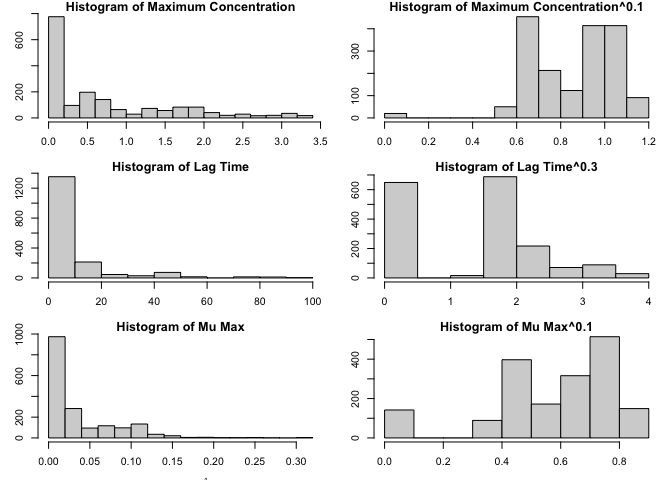<!-- -->
